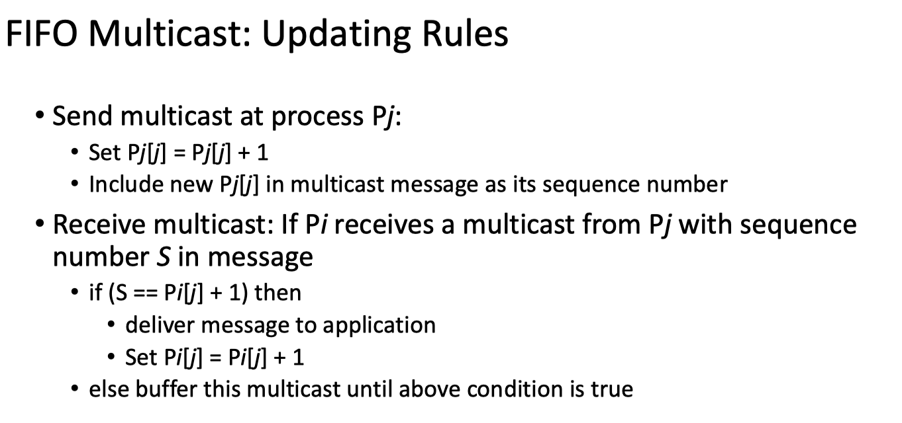
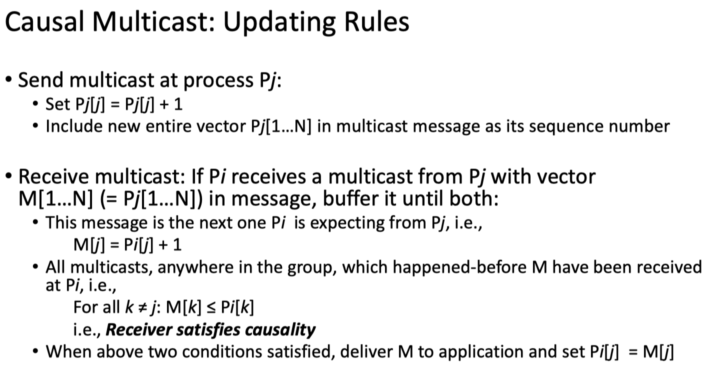
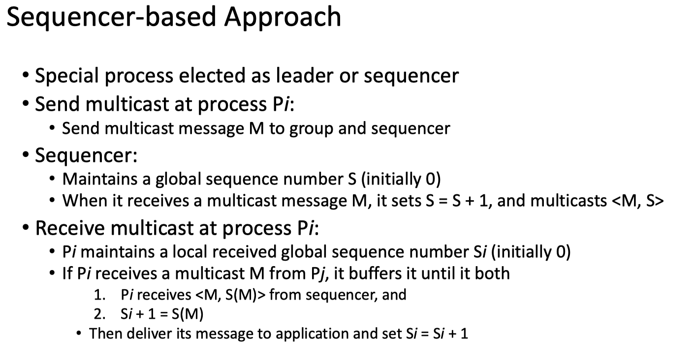

# Multicast Programming and Multicast Ordering Implementation

Cpp implementation of multicast in distributed systems.

## Environments:

All tests are on Ubuntu 16.04 LTS, g++ (Ubuntu 5.4.0-6ubuntu1~16.04.12) 5.4.0 20160609. -std=c++11.


# 1. Background Knowledge Review


## 1.1 Broadcast, Multicast, Unicast

The 3 types of communication forms in DS are listed below. In this project all are needed.
- Broadcast, message sent to all processes (anywhere)
- Multicast, message sent to a group of processes
- Unicast, message sent from one sender process to one receiver process

For multicast, we care about the order issue. There arre 3 types multicast ordering approaches:
- **FIFO ordering**: If a correct process issues (sends) multicast(g,m) to group g and then multicast(g,m’), then every correct  process that receives m’ would already have received m
- **Causal ordering**: If multicast(g,m) -> multicast(g,m’)  then any correct process that delivers m’would already have delivered m. (is Lamport’s happens-before)
- **Total ordering**: If a correct process P delivers message m before m’ (independent of the senders), then any other correct process P’ that receives m’ would already have received m.


# 2. Assignment step details 

Implement the causal ordered multicasting for the distributed system. Create two threads for each process, one for sending the multicast message to other nodes and one for listening to its communication port. Use vector clocks to enforce the order of messages. Once a process delivers a received message to a user, it prints out the message on screen. You can assume that the number of processes (machines) is fixed (equal to or larger than 3) and processes will not fail, join, or leave the distributed system. Implement two versions of this program, one without causally ordered multicasting and one with this feature. Compare the results of the two programs.


## 2.1 Steps for assignment 2 - Multicast ordering

This part asks for implementing two of FIFO ordering, Causal ordering and Total ordering.

- For FIFO ordering and Causal ordering:
1. Implement at least 3 process. Each has 2 threads, one for sending messages while another for receiving messages.
2. Use vector clocks for clock synchronization and a vector of pre-sender sequence number data structure for message ordering. 
3. Use different updating rules for delivering and buffering, for FIFO and Causal respectively (see below figure).




- For Total ordering:
1. Select one process as sequencer (leader) arbitrarily. Use sequencer-based approach (see below figure).



# 3. Implementation

## 3.1 Multicast programming

First of all we need **to implement multicast**. It is little different than [server-client socket programming](proj1).

Note: In below blocks, each block will have 3 lines of code, they all will follow this order and color style:
```diff
function definition, or parameter order or definition

- server-client socket programming

+ multicast programming
```

IP multicasting provides the capability for an application to send a single IP datagram that a **group** of hosts in a network can receive.  The hosts that are in the group may reside on a single subnet or may be on different subnets that have been connected by multicast capable routers.

### 3.1.1. Multicast IP addresses range 

Multicasting has its own Class D IP addressing scheme, controlled and assigned by the Internet Assigned Numbers Authority (IANA). This means that all IP multicasts are in the **range of 224.0.0.0 to 239.255.255.255**<sup>[Range](https://www.sciencedirect.com/topics/computer-science/multicasting)</sup>. Multicast IP Routing protocols are used to distribute data (for example, audio/video streaming broadcasts) to multiple recipients. Using multicast, a source can send a single copy of data to a single multicast address, which is then distributed to an entire group of recipients<sup>[Usage](https://www.metaswitch.com/knowledge-center/reference/what-is-multicast-ip-routing)</sup>. Multicast routers should not forward any multicast datagram with destination addresses in this range (224.0.0.0 and 224.0.0.255, inclusive), regardless of its TTL<sup>[IANA](https://www.iana.org/assignments/multicast-addresses/multicast-addresses.xhtml)</sup>.


In my implemention, I chose 226.1.1.1:
```cpp
/* Initialize the group sockaddr structure with a */
/* group address of 226.1.1.1 and port 5555. */
struct sockaddr_in group_address;
memset((char *) &group_address, 0, sizeof(group_address));
group_address.sin_family = AF_INET;
group_address.sin_addr.s_addr = inet_addr("226.1.1.1");
group_address.sin_port = htons(5555);
```


### 3.1.2 Use *SOCK_STREAM* for multicasting 

For multicasting, it must be a *socket* of the family AF_INET and its type may be either SOCK_DGRAM or SOCK_RAW. The most common use is with **SOCK_DGRAM** sockets. Each multicast transmission is sent from a single network interface, even if the host has more than one multicasting-capable interface. It is a one-to-many transmission method.  You cannot use connection-oriented sockets of type SOCK_STREAM for multicasting.
```diff
int socket(int domain, int type, int protocol);

- // Creating socket file descriptor (IPv4, TCP, IP)
- if ((server_socket_fd = socket(AF_INET, SOCK_STREAM, 0)) == 0){err socket failed}


+ // Creating socket file descriptor (IPv4, UDP, IP)
+ // For multicast it must be family AF_INET, and its type may be either SOCK_DGRAM or SOCK_RAW. The most common use is with SOCK_DGRAM sockets
+ if ((server_socket_fd = socket(AF_INET, SOCK_DGRAM, 0)) == 0){err socket failed}
```


Other common 2nd arguments used in socket() for different IP protocols<sup>1</sup>:
```
tcp_socket = socket(AF_INET, SOCK_STREAM, 0);
udp_socket = socket(AF_INET, SOCK_DGRAM, 0);
raw_socket = socket(AF_INET, SOCK_RAW, protocol);
```


### 3.1.2 Use *setsockopt()* to change default configurations of ***socket layer and protocol options***

After socket()  creates a [socket](https://man7.org/linux/man-pages/man7/socket.7.html), it has many defualt configurations for both socket layer and protocol options. These configurations are also called "options", "flags" somewhere.
- For the full list of **socket layer options** please refer to the [Socket options on this page](https://man7.org/linux/man-pages/man7/socket.7.html). They are *SOL_SOCKET level (which is 2nd argument)*. For example ```setsockopt(server_socket_fd, SOL_SOCKET, SO_REUSEADDR | SO_REUSEPORT, &opt, sizeof(opt))```.
- For the full list of **protocol options** please refer to the [Socket options on this page](https://man7.org/linux/man-pages/man7/ip.7.html). They are *IPPROTO_IP level*. For example ```setsockopt(server_socket_fd, IPPROTO_IP, IP_MULTICAST_LOOP, 0, 1)```. 

It's ok to don't change them in most cases. In previous [server-client socket programming](proj1) we have used SO_REUSEADDR | SO_REUSEPORT in *SOL_SOCKET level* to avoid address conflict. In multicast programming we need change more configurations in *IPPROTO_IP level*.  

The actual fucntion we use set or get socket layer or protocol options are:
[getsockopt(2) and setsockopt(2)](https://man7.org/linux/man-pages/man2/getsockopt.2.html): 

```cpp
int setsockopt(int sockfd, int level, int optname, const void *optval, socklen_t optlen);
int getsockopt(int sockfd, int level, int optname, void *restrict optval, socklen_t *restrict optlen);
```

When a socket of type SOCK_DGRAM is created, an application can use the **setsockopt()** function to control the **multicast** characteristics associated with that socket.  The most common-used *IPPROTO_IP level* flags include<sup>2, 3</sup>:

Sending IPv4 Multicast Datagrams：
- ***IP_MULTICAST_IF***:  Sets the interface over which outgoing multicast datagrams are sent.

    Each multicast transmission is sent from a single network interface, even if the host has more than one multicast-capable interface. If the host is also a multicast router and the TTL is greater than 1, a multicast can be forwarded to interfaces other than the originating interface. 
    
    Usually, the system administrator specifies the default interface multicast datagrams should be sent from. The programmer can override this and choose a concrete outgoing interface for a given socket with an option. This socket option is available to override the default for subsequent transmissions from a given socket:
    ```cpp
    struct in_addr addr;
    setsockopt(sock, IPPROTO_IP, IP_MULTICAST_IF, &addr, sizeof(addr));
    ```
    where *addr* is the local IP address of the desired outgoing interface. Revert to the default interface by specifying the address *INADDR_ANY*.

    To [check local multicast capable interface](https://www.thegeekdiary.com/how-to-configure-multicast-on-an-ip-address-interface/).

    Mine is 192.168.169.154 with "UP ... MULTICAST":
    ```shell
    $ ifconfig
    ens33     Link encap:Ethernet  HWaddr 00:0c:29:a4:ec:07  
            inet addr:192.168.169.154  Bcast:192.168.169.255  Mask:255.255.255.0
            inet6 addr: fe80::507e:57bc:669c:82cc/64 Scope:Link
            UP BROADCAST RUNNING MULTICAST  MTU:1500  Metric:1
            RX packets:28157 errors:0 dropped:0 overruns:0 frame:0
            TX packets:16109 errors:0 dropped:0 overruns:0 carrier:0
            collisions:0 txqueuelen:1000 
            RX bytes:15901843 (15.9 MB)  TX bytes:2654319 (2.6 MB)

    lo        Link encap:Local Loopback  
            inet addr:127.0.0.1  Mask:255.0.0.0
            inet6 addr: ::1/128 Scope:Host
            UP LOOPBACK RUNNING  MTU:65536  Metric:1
            RX packets:3563 errors:0 dropped:0 overruns:0 frame:0
            TX packets:3563 errors:0 dropped:0 overruns:0 carrier:0
            collisions:0 txqueuelen:1000 
            RX bytes:320936 (320.9 KB)  TX bytes:320936 (320.9 KB)
    ```

- ***IP_MULTICAST_TTL***:  Sets the Time To Live (TTL) in the IP header for outgoing multicast datagrams.  By default it is set to 1 to prevent them to be forwarded beyond the local network.  TTL of 0 are not transmitted on any sub-network.  Multicast datagrams with a TTL of greater than 1 may be delivered to more than one sub-network, if there are one or more multicast routers attached to the first sub-network.

    To change the TTL to the value you desire (from 0 to 255), put that value into a variable (here I name it "ttl") and write somewhere in your program:
    ```cpp
    // 0 Are restricted to the same host
    // 1 Are restricted to the same subnet
    // 32 Are restricted to the same site
    // 64 Are restricted to the same region
    // 128 Are restricted to the same continent
    // 255 Are unrestricted in scope

    u_char ttl;
    setsockopt(socket, IPPROTO_IP, IP_MULTICAST_TTL, &ttl, sizeof(ttl));
    ```
    

    The behavior with getsockopt() is similar to the one seen on IP_MULTICAST_LOOP.


- ***IP_MULTICAST_LOOP***:  Specifies whether or not a copy of an outgoing multicast datagram is delivered to the sending host as long as it is a member of the multicast group.
    
    To use, write:
    ```cpp
    u_char loop;
    setsockopt(socket, IPPROTO_IP, IP_MULTICAST_LOOP, &loop, sizeof(loop));
    ```
    and set loop to 1 to enable loopback or 0 to disable it. Default is 1.
    To know whether a socket is currently looping-back or not use something like:
    ```cpp
    u_char loop;
    int size;
    getsockopt(socket, IPPROTO_IP, IP_MULTICAST_LOOP, &loop, &size);
    ```
Receiving IPv4 Multicast Datagrams： 
   
- ***IP_ADD_MEMBERSHIP***:  Joins the multicast group specified.

    Before a host can receive IP multicast datagrams, the host must become a member of one or more IP multicast groups. A process can ask the host to join a multicast group by using the following socket option:


- ***IP_DROP_MEMBERSHIP***:  Leaves the multicast group specified.

```diff
int setsockopt(int socket, int level, int option_name, const void *option_value, socklen_t option_len);

- // Optional: it helps in reuse of address and port. Prevents error such as: “address already in use”.
- if (setsockopt(server_socket_fd, SOL_SOCKET, SO_REUSEADDR | SO_REUSEPORT, &opt, sizeof(opt))){}

+ // Optional: it helps in reuse of address and port. Prevents error such as: “address already in use”.
+ int opt = 1; // for setsockopt
+ if (setsockopt(server_socket_fd, SOL_SOCKET, SO_REUSEADDR | SO_REUSEPORT, &opt, sizeof(opt)) < 0){
+    perror("Server: setsockopt SOL_SOCKET");
+    exit(EXIT_FAILURE);
+ }
+ // For multicast, the level (2nd param) should be IPPROTO_IP which has multiple options. 
+ // IP_MULTICAST_LOOP: 0 if you want the data you send to be looped back to your host, 1 if not. Default is 0. We don't need to change.
+ // IP_MULTICAST_TTL: Sets the Time To Live (TTL) in the IP header for outgoing multicast datagrams. 0 samehost. 1 same subnet. Default is 1. 
+ u_char ttl = '0'; // because we use only one machine 
+ if (setsockopt(server_socket_fd, IPPROTO_IP, IP_MULTICAST_TTL, &ttl, sizeof(ttl)) < 0)                                              
+ {
+    perror("Server: setsockopt IPPROTO_IP IP_MULTICAST_TTL");
+    exit(EXIT_FAILURE);
+ }
+ /* Set local interface for outbound multicast datagrams. */
+ /* The IP address specified must be associated with a local multicast capable interface. */
+ struct in_addr localInterface;
+ localInterface.s_addr = inet_addr("192.168.169.154"); // On linux use ifconfig to check "UP ... MULTICAST"
+ if(setsockopt(sd, IPPROTO_IP, IP_MULTICAST_IF, (char *)&localInterface, sizeof(localInterface)) < 0)
+ {
+    perror("Server: setsockopt IPPROTO_IP IP_MULTICAST_IF");
+    exit(EXIT_FAILURE);
+ }   
```


References:
1. SYNOPSIS section in https://man7.org/linux/man-pages/man7/ip.7.html
2. *IPPROTO_IP level* options/flags https://tldp.org/HOWTO/Multicast-HOWTO-6.html
3. Oracle Using Multicast - send, receive IPv4 Multicast Datagrams https://docs.oracle.com/cd/E23824_01/html/821-1602/sockets-137.html