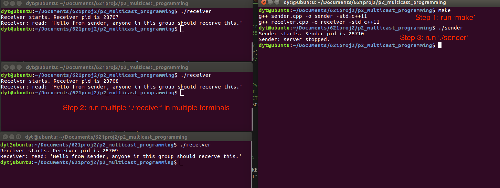
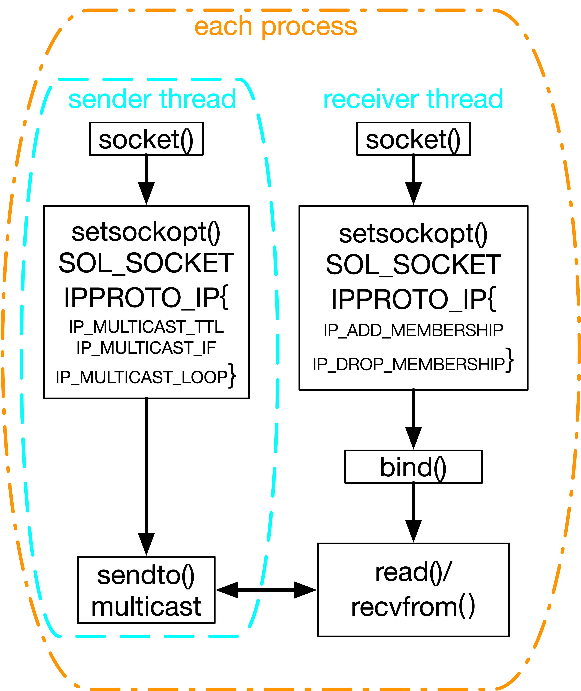
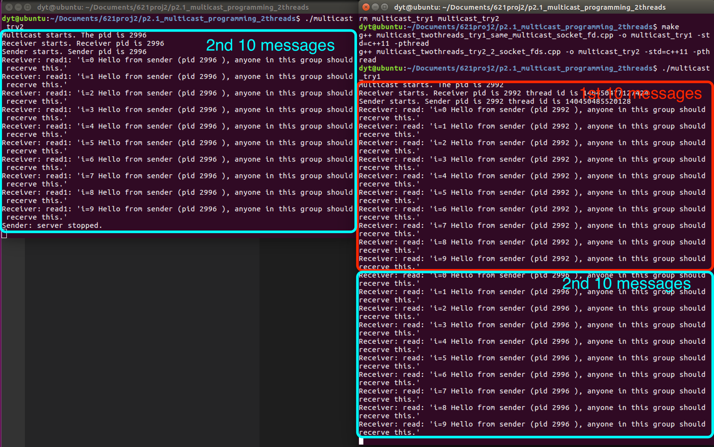

# Multicast Programming and Multicast Ordering Implementation

Firstly I implemented the multicast cpp implementation in distributed systems. Code are in [p2_multicast_programming](p2_multicast_programming) dir, and [p2.1_multicast_programming_2threads](p2.1_multicast_programming_2threads) dir. The latter one uses one process with 2 threads. One for sending messages while another one for continuously receiving messages from multicast group. 

Secondly, based on that, I implemented multicast ordering for DS, including FIFO ordering, causal ordering and total ordering.

## Environments:

All tests are on Ubuntu 16.04 LTS, g++ (Ubuntu 5.4.0-6ubuntu1~16.04.12) 5.4.0 20160609. -std=c++11.

# 1. Assignment 
Implement the causal ordered multicasting for the distributed system. Create two threads for each process, one for sending the multicast message to other nodes and one for listening to its communication port. Use vector clocks to enforce the order of messages. Once a process delivers a received message to a user, it prints out the message on screen. You can assume that the number of processes (machines) is fixed (equal to or larger than 3) and processes will not fail, join, or leave the distributed system. Implement two versions of this program, one without causally ordered multicasting and one with this feature. Compare the results of the two programs.


This assignment belongs to Proj2-Assignment2. More assignment details: [PDF here](Project2_Fall2021.pdf).

# 2. Background Knowledge Review


## 2.1 Broadcast, Multicast, Unicast

The 3 types of communication forms in DS are listed below. In this project all are needed.
- Broadcast, message sent to all processes (anywhere).
- Multicast, message sent to a group of processes. This will be introduced in section 4.1.
- Unicast, message sent from one sender process to one receiver process. This has been done in [proj1-bank-accounts-mng](https://github.com/DayuanTan/DistributedOS-A-Centralized-Multi-User-Concurrent-Bank-Account-Manager-Multithread-Synchronization) and [proj2-assign1-berkeley (Phase 1)](https://github.com/DayuanTan/berkeley-algorithm-implementation).

## 2.2 Multicast ordering
For multicast, we care about the order issue. There arre 3 types multicast ordering approaches:
- **FIFO ordering**: If a correct process issues (sends) multicast(g,m) to group g and then multicast(g,m’), then every correct  process that receives m’ would already have received m
- **Causal ordering**: If multicast(g,m) -> multicast(g,m’)  then any correct process that delivers m’would already have delivered m. (is Lamport’s happens-before)
- **Total ordering**: If a correct process P delivers message m before m’ (independent of the senders), then any other correct process P’ that receives m’ would already have received m.

## 2.3 Updateing rules of FIFO, Causal and Total ordering


Examples of FIFO,  Causal and Total ordering refer to [Prof. Banerjee's slides](slides) and [here](https://courses.engr.illinois.edu/cs425/fa2020/L16.FA20.pdf).

## 2.4 Message structure

It is worth to highlight that the message data structure of three multicast ordering algorithms are different.
- **FIFO ordering**: each process(node) multicast its own local clock (sequence number) to all 
- **Causal ordering**: each process(node) multicast the vector clocks which includes all process(node)'s clocks array (sequence numbers array) to all
- **Total ordering**: the multicast messages from sequencer to all contain the global sequence number


# 3. Assignment step details 

## 3.1 Steps for assignment 2 - Multicast programming

Before we dive into multicast ordering, we need to implement multicast programming using socket. It is different than the basic socket peer-to-peer programming like we did in [proj1 a server-clients structure bank accounts mng system](https://github.com/DayuanTan/DistributedOS-A-Centralized-Multi-User-Concurrent-Bank-Account-Manager-Multithread-Synchronization) where each client has a connection with the server, similar as [proj2-assign1-berkeley (Phase 1)](https://github.com/DayuanTan/berkeley-algorithm-implementation). Section 4.1 explains the difference from coding perspective.

## 3.2 Steps for assignment 2 - Multicast ordering

This part asks for implementing two of FIFO ordering, Causal ordering and Total ordering.

- For FIFO ordering and Causal ordering:
1. Implement at least 3 process. Each has 2 threads, one for sending messages while another for receiving messages.
2. Use vector clocks for clock synchronization and a vector of pre-sender sequence number data structure for message ordering. 
3. Use different updating rules for delivering and buffering, for FIFO and Causal respectively (see section 2.3 updating rules).


- For Total ordering:
1. Select one process as sequencer (leader) arbitrarily. Use sequencer-based approach (see section 2.3 updating rules).

# 4. Implementation Explanation

1. Firstly I Implemented multicast programming for 1 sender and multiple receivers using sender.cpp and receiver.cpp files. -- Phase 2.0
2. Secondly I merged them into one process with 2 threads. One for sending messages while another one for continuously receiving messages from multicast group. This is required in assignment 2. -- Phase 2.1
3. Thridly I implemented FIFO ordering, causal ordering and total ordering. -- Phase 3.


# 4.1 Multicast programming (Phase 2.0)

First of all we need **to implement multicast** (code are in [p2_multicast_programming](p2_multicast_programming) dir). It is little different than [server-client (p2p) socket programming](https://github.com/DayuanTan/DistributedOS-A-Centralized-Multi-User-Concurrent-Bank-Account-Manager-Multithread-Synchronization).


Note: In below blocks, each block will have 3 lines of code, they all will follow this order and color style:
```diff
function definition, or parameter order or definition

- server-client socket programming

+ multicast programming
```

IP multicasting provides the capability for an application to send a single IP datagram that a **group** of hosts in a network can receive.  The hosts that are in the group may reside on a single subnet or may be on different subnets that have been connected by multicast capable routers.

## 4.1.1. Multicast IP addresses range 

Multicasting has its own Class D IP addressing scheme, controlled and assigned by the Internet Assigned Numbers Authority (IANA). This means that all IP multicasts are in the **range of 224.0.0.0 to 239.255.255.255**<sup>[Range](https://www.sciencedirect.com/topics/computer-science/multicasting)</sup>. Multicast IP Routing protocols are used to distribute data (for example, audio/video streaming broadcasts) to multiple recipients. Using multicast, a source can send a single copy of data to a single multicast address, which is then distributed to an entire group of recipients<sup>[Usage](https://www.metaswitch.com/knowledge-center/reference/what-is-multicast-ip-routing)</sup>. Multicast routers should not forward any multicast datagram with destination addresses in this range (224.0.0.0 and 224.0.0.255, inclusive), regardless of its TTL<sup>[IANA](https://www.iana.org/assignments/multicast-addresses/multicast-addresses.xhtml)</sup>.


In my implemention, I chose 226.1.1.1:
```cpp
/* Initialize the group sockaddr structure with a */
/* group address of 226.1.1.1 and port 5555. */
struct sockaddr_in group_address;
memset((char *) &group_address, 0, sizeof(group_address));
group_address.sin_family = AF_INET;
group_address.sin_addr.s_addr = inet_addr("226.1.1.1");
group_address.sin_port = htons(5555);
```


## 4.1.2 Use *SOCK_STREAM* for multicasting 

For multicasting, it must be a *socket* of the family AF_INET and its type may be either SOCK_DGRAM or SOCK_RAW. The most common use is with **SOCK_DGRAM** sockets. Each multicast transmission is sent from a single network interface, even if the host has more than one multicasting-capable interface. It is a one-to-many transmission method.  You cannot use connection-oriented sockets of type SOCK_STREAM for multicasting.
```diff
int socket(int domain, int type, int protocol);

- // Creating socket file descriptor (IPv4, TCP, IP)
- if ((server_socket_fd = socket(AF_INET, SOCK_STREAM, 0)) == 0){err socket failed}


+ // For multicast it must be family AF_INET, and its type may be either SOCK_DGRAM or SOCK_RAW. The most common use is with SOCK_DGRAM sockets
+ if ((sender_socket_fd = socket(AF_INET, SOCK_DGRAM, 0)) == 0) // (IPv4, UDP, IP)
+ { perror }
```


Other common 2nd arguments used in socket() for different IP protocols<sup>1</sup>:
```
tcp_socket = socket(AF_INET, SOCK_STREAM, 0);
udp_socket = socket(AF_INET, SOCK_DGRAM, 0);
raw_socket = socket(AF_INET, SOCK_RAW, protocol);
```

For this part, sender.cpp and receiver.cpp are  same.


## 4.1.3 Use *setsockopt()* to change default configurations of ***socket layer and protocol options***

After socket()  creates a [socket](https://man7.org/linux/man-pages/man7/socket.7.html), it has many defualt configurations for both socket layer and protocol options. These configurations are also called "options", "flags" somewhere.
- For the full list of **socket layer options** please refer to the [Socket options on this page](https://man7.org/linux/man-pages/man7/socket.7.html). They are *SOL_SOCKET level (which is 2nd argument)*. For example ```setsockopt(server_socket_fd, SOL_SOCKET, SO_REUSEADDR | SO_REUSEPORT, &opt, sizeof(opt))```.
- For the full list of **protocol options** please refer to the [Socket options on this page](https://man7.org/linux/man-pages/man7/ip.7.html). They are *IPPROTO_IP level*. For example ```setsockopt(server_socket_fd, IPPROTO_IP, IP_MULTICAST_LOOP, 0, 1)```. 

It's ok to don't change them in most cases. In previous [server-client socket programming](https://github.com/DayuanTan/DistributedOS-A-Centralized-Multi-User-Concurrent-Bank-Account-Manager-Multithread-Synchronization) we have used SO_REUSEADDR | SO_REUSEPORT in *SOL_SOCKET level* to avoid address conflict. In multicast programming we need change more configurations in *IPPROTO_IP level*.  

The actual fucntion we use set or get socket layer or protocol options are:
[getsockopt(2) and setsockopt(2)](https://man7.org/linux/man-pages/man2/getsockopt.2.html): 

```cpp
int setsockopt(int sockfd, int level, int optname, const void *optval, socklen_t optlen);
int getsockopt(int sockfd, int level, int optname, void *restrict optval, socklen_t *restrict optlen);
```

When a socket of type SOCK_DGRAM is created, an application can use the **setsockopt()** function to control the **multicast** characteristics associated with that socket.  The most common-used *IPPROTO_IP level* flags include<sup>2, 3</sup>:

Sending IPv4 Multicast Datagrams：
- ***IP_MULTICAST_IF***:  Sets the interface over which outgoing multicast datagrams are sent.

    Each multicast transmission is sent from a single network interface, even if the host has more than one multicast-capable interface. If the host is also a multicast router and the TTL is greater than 1, a multicast can be forwarded to interfaces other than the originating interface. 
    
    Usually, the system administrator specifies the default interface multicast datagrams should be sent from. The programmer can override this and choose a concrete outgoing interface for a given socket with an option. This socket option is available to override the default for subsequent transmissions from a given socket:
    ```cpp
    struct in_addr addr;
    setsockopt(sock, IPPROTO_IP, IP_MULTICAST_IF, &addr, sizeof(addr));
    ```
    where *addr* is the local IP address of the desired outgoing interface. Revert to the default interface by specifying the address *INADDR_ANY*.

    To [check local multicast capable interface](https://www.thegeekdiary.com/how-to-configure-multicast-on-an-ip-address-interface/), use ```ifconfig```.

    Mine is 192.168.169.154 with "UP ... MULTICAST":
    ```shell
    $ ifconfig
    ens33     Link encap:Ethernet  HWaddr 00:0c:29:a4:ec:07  
            inet addr:192.168.169.154  Bcast:192.168.169.255  Mask:255.255.255.0
            inet6 addr: fe80::507e:57bc:669c:82cc/64 Scope:Link
            UP BROADCAST RUNNING MULTICAST  MTU:1500  Metric:1
            RX packets:28157 errors:0 dropped:0 overruns:0 frame:0
            TX packets:16109 errors:0 dropped:0 overruns:0 carrier:0
            collisions:0 txqueuelen:1000 
            RX bytes:15901843 (15.9 MB)  TX bytes:2654319 (2.6 MB)

    lo        Link encap:Local Loopback  
            inet addr:127.0.0.1  Mask:255.0.0.0
            inet6 addr: ::1/128 Scope:Host
            UP LOOPBACK RUNNING  MTU:65536  Metric:1
            RX packets:3563 errors:0 dropped:0 overruns:0 frame:0
            TX packets:3563 errors:0 dropped:0 overruns:0 carrier:0
            collisions:0 txqueuelen:1000 
            RX bytes:320936 (320.9 KB)  TX bytes:320936 (320.9 KB)
    ```

- ***IP_MULTICAST_TTL***:  Sets the Time To Live (TTL) in the IP header for outgoing multicast datagrams.  By default it is set to 1 to prevent them to be forwarded beyond the local network.  TTL of 0 are not transmitted on any sub-network.  Multicast datagrams with a TTL of greater than 1 may be delivered to more than one sub-network, if there are one or more multicast routers attached to the first sub-network.

    To change the TTL to the value you desire (from 0 to 255), put that value into a variable (here I name it "ttl") and write somewhere in your program:
    ```cpp
    // 0 Are restricted to the same host
    // 1 Are restricted to the same subnet
    // 32 Are restricted to the same site
    // 64 Are restricted to the same region
    // 128 Are restricted to the same continent
    // 255 Are unrestricted in scope

    u_char ttl;
    setsockopt(socket, IPPROTO_IP, IP_MULTICAST_TTL, &ttl, sizeof(ttl));
    ```
    

    The behavior with getsockopt() is similar to the one seen on IP_MULTICAST_LOOP.


- ***IP_MULTICAST_LOOP***:  Specifies whether or not a copy of an outgoing multicast datagram is delivered to the sending host as long as it is a member of the multicast group.
    
    To use, write:
    ```cpp
    u_char loop;
    setsockopt(socket, IPPROTO_IP, IP_MULTICAST_LOOP, &loop, sizeof(loop));
    ```
    and set loop to 1 to enable loopback or 0 to disable it. Default is 1.
    To know whether a socket is currently looping-back or not use something like:
    ```cpp
    u_char loop;
    int size;
    getsockopt(socket, IPPROTO_IP, IP_MULTICAST_LOOP, &loop, &size);
    ```
Receiving IPv4 Multicast Datagrams： 
   
- ***IP_ADD_MEMBERSHIP***:  Joins the multicast group specified.

    Before a host can receive IP multicast datagrams, the host must become a member of one or more IP multicast groups. A process can ask the host to join a multicast group by using the following socket option:

    ````cpp
    struct ip_mreq mreq;
    setsockopt(sock, IPPROTO_IP, IP_ADD_MEMBERSHIP, &mreq, sizeof(mreq))
    ````
    where *mreq* is the structure:
    ```
    struct ip_mreq {
        struct in_addr imr_multiaddr;   /* multicast group to join */
        struct in_addr imr_interface;   /* interface to join on */
    }
    ```
    Each membership is associated with a single interface. You can join the same group on more than one interface. Specify the imr_interface address as INADDR_ANY to choose the default multicast interface. You can also specify one of the host's local addresses to choose a particular multicast-capable interface.

- ***IP_DROP_MEMBERSHIP***:  Leaves the multicast group specified.

My code for setsockopt part of sender.cpp:
```diff
int setsockopt(int socket, int level, int option_name, const void *option_value, socklen_t option_len);

- // Optional: it helps in reuse of address and port. Prevents error such as: “address already in use”.
- if (setsockopt(server_socket_fd, SOL_SOCKET, SO_REUSEADDR | SO_REUSEPORT, &opt, sizeof(opt))){}

+ // Optional: it helps in reuse of address and port. Prevents error such as: “address already in use”.
+ int opt = 1; // for setsockopt
+ if (setsockopt(sender_socket_fd, SOL_SOCKET, SO_REUSEADDR | SO_REUSEPORT, &opt, sizeof(opt)) < 0){
+     perror("Sender: setsockopt SOL_SOCKET");
+     exit(EXIT_FAILURE);
+ }
+ // For multicast, the level (2nd param) should be IPPROTO_IP which has multiple options. 
+ // IP_MULTICAST_LOOP: 0 if you want the data you send to be looped back to your host, 1 if not. Default is 0. We don't need to change.
+ // IP_MULTICAST_TTL: Sets the Time To Live (TTL) in the IP header for outgoing multicast datagrams. 0 samehost. 1 same subnet. Default is 1. 
+ u_char ttl = '0'; // because we use only one machine 
+ if (setsockopt(sender_socket_fd, IPPROTO_IP, IP_MULTICAST_TTL, &ttl, sizeof(ttl)) < 0)                                              
+ {
+     perror("Sender: setsockopt IPPROTO_IP IP_MULTICAST_TTL");
+     exit(EXIT_FAILURE);
+ }
+ /* Set local interface for outbound multicast datagrams. */
+ /* The IP address specified must be associated with a local multicast capable interface. */
+ struct in_addr localInterface;
+ localInterface.s_addr = inet_addr("192.168.169.154"); // On linux use ifconfig to check "UP ... MULTICAST"
+ if(setsockopt(sender_socket_fd, IPPROTO_IP, IP_MULTICAST_IF, (char *)&localInterface, sizeof(localInterface)) < 0)
+ {
+     perror("Sender: setsockopt IPPROTO_IP IP_MULTICAST_IF");
+     exit(EXIT_FAILURE);
+ }
```

My code for setsockopt part of receiver.cpp:
```diff
int setsockopt(int socket, int level, int option_name, const void *option_value, socklen_t option_len);

-

+ // Optional: it helps in reuse of address and port. Prevents error such as: “address already in use”.
+ int opt = 1; // for setsockopt
+ if (setsockopt(receiver_socket_fd, SOL_SOCKET, SO_REUSEADDR | SO_REUSEPORT, &opt, sizeof(opt)) < 0){
+     perror("Receiver: setsockopt SOL_SOCKET");
+     exit(EXIT_FAILURE);
+ }

+ /* Bind to the proper port number with the IP address specified as INADDR_ANY. */
+ struct sockaddr_in receiver_addr;
+ receiver_addr.sin_family = AF_INET;
+ receiver_addr.sin_addr.s_addr = INADDR_ANY; //is localhost
+ receiver_addr.sin_port = htons(PORT); 
+ // Forcefully attaching socket to the port 8080
+ if (bind(receiver_socket_fd, (struct sockaddr *)&receiver_addr, sizeof(receiver_addr))<0)
+ {
+     perror("Receiver: bind failed");
+     exit(EXIT_FAILURE);
+ } 

+ /* Join the multicast group 226.1.1.1 on the local interface 192.168.169.154 interface. */
+ /* Note that this IP_ADD_MEMBERSHIP option must be */
+ /* called for each local interface over which the multicast */
+ /* datagrams are to be received. */
+ struct ip_mreq group;
+ group.imr_multiaddr.s_addr = inet_addr("226.1.1.1");
+ group.imr_interface.s_addr = inet_addr("192.168.169.154");
+ if (setsockopt(receiver_socket_fd, IPPROTO_IP, IP_ADD_MEMBERSHIP, (char *)&group, sizeof(group)) < 0)
+ {
+     perror("Receiver: Adding multicast group error");
+     exit(EXIT_FAILURE);
+ }


```

## 4.1.4 send/multicast

Use sendto() for sending data. send() works for connected sockets. sendto() works for either connected or unconnected sockets.

```cpp
// // sending a message to client/multicast
const char *msg = "Hello from sender, anyone in this group should recerve this.";
// sendto(client_sockets[i] , msg , strlen(msg) , 0 );
/* Send a message to the multicast group specified by the group_address sockaddr-structure. */
if(sendto(sender_socket_fd, msg, strlen(msg), 0, (struct sockaddr*)&groupSock, sizeof(groupSock)) < 0)
{
    perror("Sender: Sending datagram message error");
    exit(EXIT_FAILURE);
}
```


## 4.1.5 receive

read() can handle file or socket. If the fd is a socket, read() is equivalent to recv() with no flags set. The recv() call applies only to connected sockets. The recvfrom() function applies to any datagram socket, whether connected or unconnected.

```cpp
// receiving form multicast
if (read(receiver_socket_fd , receiver_read_buffer, 1024) < 0){
    perror("Receiver: read() error");
    exit(EXIT_FAILURE);
}
printf("Receiver: read: '%s'\n",receiver_read_buffer );

or

socklen_t receiver_addr_length = sizeof(receiver_addr);
if (recvfrom(multicast_socket_fd, receiver_read_buffer, 1024, 0, (struct sockaddr *)&receiver_addr, &receiver_addr_length) < 0){
    perror("Receiver: recvfrom() error");
    exit(EXIT_FAILURE);
}
printf("Receiver: read: '%s'\n",receiver_read_buffer );
memset(receiver_read_buffer, '\0', strlen(receiver_read_buffer));
```

The below screenshot shows how I ran it with 1 sender 3 receiverrs. 
1. Run ```make```.
2. Run ```./receiver``` in multiple terminals. 
3. Then run ```./sender``` in multiple ternimals. 

(This implementation only receives one message you can modify it to receive multiple messages easily.)



References:
1. SYNOPSIS section in https://man7.org/linux/man-pages/man7/ip.7.html
2. *IPPROTO_IP level* options/flags https://tldp.org/HOWTO/Multicast-HOWTO-6.html
3. Oracle Using Multicast - send, receive IPv4 Multicast Datagrams https://docs.oracle.com/cd/E23824_01/html/821-1602/sockets-137.html
4. Multicast Sockets - Programming Tips http://www.cs.unc.edu/~jeffay/dirt/FAQ/comp249-001-F99/mcast-socket.html


# 4.2 Multicast programming using 2 threads (Phase 2.1)


Based on phase 2.0, I changed it to multicast programming using 2 threads which is required for this assignment. One thread for sending messages while another thread for continuously receiving messages from multicast group.

Code are in [p2.1_multicast_programming_2threads](p2.1_multicast_programming_2threads) dir. 



I implemented it in 2 ways. They both work well:

- In try1 version I used **same** socket_fd for sender and receiver threads. 
- In try2 version I used **different** socket_fd for sender and receiver threads. In this version sender() and receiver() function are identical to sender.cpp and receiver.cpp in 4.1 section with small modification about loop for sendto and recvfrom. 


The below screenshot shows how I ran it: 
1. Run ```make```.
2. Run ```./multicast_try1``` in first terminal. It works well.
3. Then run ```./multicast_try2``` in second terminals. The 2nd terminal got 10 messages while the 1st terminal got 10 more messages (bc the receiver of 1st terminal didn't stop).




Reference:

1. Cpp multi-thread https://www.geeksforgeeks.org/multithreading-in-cpp/.

# 4.3 Multicast ordering (Phase 3)

The codes in this section is based on above [p2.1_multicast_programming_2threads/multicast_twothreads_try1_same_multicast_socket_fd.cpp](p2.1_multicast_programming_2threads/multicast_twothreads_try1_same_multicast_socket_fd.cpp). 

## 4.3.1 Processes amount and counter
The assignment has clarified that "You can assume that the number of processes (machines) is fixed (equal to or larger than 3) and processes will not fail, join, or leave the distributed system." 

So I used helper funtions. 

A file "processes_amount_declared.txt" is used to store user's declaration about how many processes they will create and user must follow this number they declared. User will be ask once only when the first process is created.

A file "processes_counter.txt" is used to count how many processes/nodes we have in this DS. When you open a terminal and run ```./causal_ordering``` it will increase by 1. When you Ctrl+c to terminate a process it will decrease by 1. If you close terminal windows directly it cannot decrease it, but when next time you run this program and when ask for user input declared processes amount (this happens at very early phase) it will overwrite it to 0 before other any operations.

All below operations will be done on top of the condition that 
```cpp
the processes counter nummber == the declared processes amount
```

## 4.3.2 vector clocks data structure

```cpp
vector<int> vector_clocks;
```

Each process will maintain their own vector_clocks. Their own index is the No. of their own process inside all processes. For example, the firstly created process will have process No. 1 and vector_clocks[0] represents itself. Similarly the secondly created process will have process No. 2 and vector_clocks[1] represents itself.

More examples: (Assuming there are 3 processes/nodes totally. Each of them has their own variable ```vector_clocks``` in their process.)

The variable ```vector_clocks```  in process/node No. 1 stores vector clocks like this:
```
{Node1's local clock, Node1's knowledge of Node2's clock, Node1's knowledge of Node3's clock}
```

The variable ```vector_clocks```  in process/node No. 2 stores vector clocks like this:
```
{Node2's knowledge of Node1's clock, Node2's local clock, Node2's knowledge of Node3's clock}
```

The variable ```vector_clocks```  in process/node No. 3 stores vector clocks like this:
```
{Node3's knowledge of Node1's clock, Node3's knowledge of Node2's clock, Node3's local clock}
```


## 4.3.3 No ordering (Phase 3.0)

Every time before sending a message, each process(node) will increase its own local clock by one.

Every time after receiving a message, each process(node) will modify its knowledge of **other** process(node)'s clock according to the message it received. It doesn't modify its own clock according to received message (no need to). It only update if recevied clock is larger than local knowledge of that clock in no ordering version (different ordering algorithms have different updating rules which are implemented in Section 4.3.4 - 4.3.5).


The file [p3.0_multicast_ordering/multicast_without_ordering.cpp](p3.0_multicast_ordering/multicast_without_ordering.cpp) implemented the version without any ordering. All below versions containing different ordering algorithms are modified based on it. Helper functions will be share-used among different versions.


## 4.3.4 FIFO ordering (Phase 3.1)

The file [p3.1_multicast_ordering/multicast_fifo_ordering.cpp](p3.1_multicast_ordering/multicast_fifo_ordering.cpp) implemented the version of FIFO ordering.


### Message Structure

- Sending
    
    The messages each process(node) multicast to all processes(nodes) include its own clock (sequence number) and its own process No. value. 

    For example "I'm process No. 2 and my local clock is 5."

- Receiving
    
    After receiving the multicast message, the process(node) update/buffer its knowledge of the clock of that process. As the above example, it will updated/buffered its knowledge of clock of process No. 2 to 5.


## 4.3.5 Causal ordering 


Implement vector clocks data structure
define message content
send message

Reference:
1. catch a Ctrl+C event in C++ https://www.tutorialspoint.com/how-do-i-catch-a-ctrlplusc-event-in-cplusplus
2. cpp pass vector reference to thread https://stackoverflow.com/a/23268182/9593219
3. Convert character array to string in C++ https://www.geeksforgeeks.org/convert-character-array-to-string-in-c/